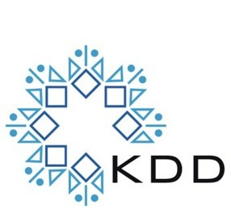

# Generalized Zero-Shot Extreme Multi-Label Learning
This is the official codebase for [KDD 2021](https://www.kdd.org/kdd2021/) paper [Generalized Zero-Shot Extreme Multi-Label Learning](http://manikvarma.org/pubs/gupta21.pdf)
> [Nilesh Gupta](https://nilesh2797.github.io/), [Sakina Bohra](https://www.linkedin.com/in/sakina-bohra-aa46b174/?originalSubdomain=in), [Yashoteja Prabhu](https://vervenumen.github.io/), Saurabh Purohit, [Manik Varma](http://manikvarma.org/)

## Running the Code
```console
# Build
make

# Train and predict ZestXML on ZS-Eurlex-4.3K dataset
./run_eurlex.sh all

# Install dependencies of metrics.py
conda env create -f zestxml-env.yml
conda activate zestxml-env

# Prints evaluation metrics
python metrics.py ZS-Eurlex-4.3K
```
## Cite
```bib
@InProceedings{Gupta21,
  author    = "Gupta, N. and Bohra, S. and Prabhu, Y. and Purohit, S. and Varma, M.",
  title     = "Generalized Zero-Shot Extreme Multi-label Learning",
  booktitle = "Proceedings of the ACM SIGKDD Conference on Knowledge Discovery and Data Mining",
  month     = "August",
  year      = "2021"
}
```
